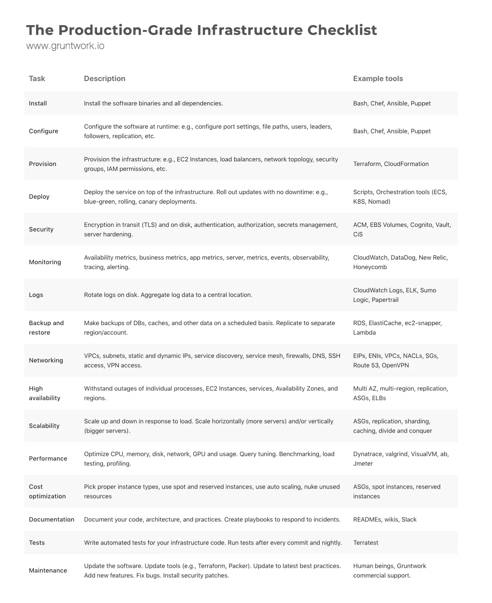

# Terraform Up and Running (2017)
__By Yevgenic Brikman__   
[Github Code Examples](https://github.com/brikis98/terraform-up-and-running-code)      
[Terraform Docs](https://developer.hashicorp.com/terraform/docs)   
[Terraform Providers](https://registry.terraform.io/browse/providers)    
[AWS Providers](https://registry.terraform.io/providers/hashicorp/aws/latest/docs)   
[Azure Providers](https://registry.terraform.io/providers/hashicorp/azurerm/latest/docs)   
[Terraform Language Documentation](https://developer.hashicorp.com/terraform/language)    
[Terraform Tutorials](https://developer.hashicorp.com/terraform/tutorials/configuration-language)     

## Chapter 1: Why Terraform
__The rise of DevOps__   
Applying DevOPs practices can reduce _lead times_ significantly for an organization.  
There are four core values in the DevOps movement: _Culture_, _Automation_, _Measurement_ and _Sharing_ (sometimes abbreviated as the acronym CAMS).  

__What is infrastructure as code__  
There are four broad categories of IAC tools:
1. Ad hoc scripts - Bash Script, Python, Ruby.
2. Configuration management tools - Ansible, Chef, Puppet and SlatStack.
3. Server templating tools - Docket, Packer and Vagrant.
4. Orchestration tools - Terraform, CloudFormation and OpenStack Heat.

## Chapter 2: An Introduction to Terraform Syntax
[AWS in Plain English](https://expeditedsecurity.com/aws-in-plain-english/)

__Installing Terraform__  
For MacOS
```
$ brew tap hashicorp/tap
$ brew install hashicorp/tap/terraform
$ terraform --version
```
For other Operating Systems, see [Install Terraform](https://developer.hashicorp.com/terraform/downloads)  
Terraform uses you configured AWS credential, so you do not need to do anything if you already have AWS CLI   configured.  

You may also install the _autocomplete package_:   
```
$ terraform -install-autocomplete
```

__Updating Terraform__  
To update terraform, you can simple install the latest version
```
$ brew install hashicorp/tap/terraform
```

__Deploy a Single server__  
Terraform code is written in the _HashiCorp Configuration Language_ (HCL) in files with the extension `.tf`.     

[AWS Instance Types](https://aws.amazon.com/ec2/instance-types/)  

After creating your terraform configuration file, or after cloning a terraform project from a repository, you navigate into the folder and run the `inti` command:  
```
$ terraform init
```
This downloads and installs the providers defined in the configuration. It will also create a lock file named `.terraform.lock.hcl`.   
Remember to add `.terraform` to your `.gitignore` file.    

Now run the `plan` command to show the changes that are required for your infrastructure:
```
$ terraform plan  
```  

To format and validate your configuration, run the `fmt` command:
```
$ terraform fmt
```  

To ensure that your configuration is syntactically valid and internally consistent run the `validate` command:  
```
$ terraform validate
```

To create the infrastructure defined in the configuration run the `apply` command:    
```
$ terraform apply
```  

After the resources are created, terraform generate a `terraform.tfstate` file which it uses to manage the state of the resources.  
To inspect the current state, use the `show` command:  
```
$ terraform show
```  

The `state` command is for advanced state management. Use the `list` subcommand to list the resources in your project's state:  
```
$ terraform state list  
```  

__Cidr block__  
For a handy calculator that converts between IP address ranges and CIDR notation, see [ipaddressguide.com/cidr](https://www.ipaddressguide.com/cidr)

__Input variable__  
The syntax for defining variable is as follows   
```
variable "variablename" {
  description = ""
  type = ""
  default = ""
}
```  
The `type` may be
1. string
2. number
3. bool
4. list (or tuple)
5. map (or object)

The value for variable can be provided in a number of ways:
* passing it in at the command line using the _-var_ option
```
$ terraform plan -var server_port=80
```
* via a file using the _-var-file_ option
* via an environment variable  of the name *TF_VAR_<variable_name>*  
If no value is passed in, the variable will fall back to this default value. If there is no default value, Terraform will interactively prompt the user for one.  

__Resource Dependency__  
Terraform shows you the dependency graph by running the graph command:
```
$ terraform graph
```  
__Resource changes__  
In Terraform, most changes to an EC2 Instance, other than metadata such as tags, actually create a completely new Instance.  

__Output__  
Use the _terraform output_ command to list outputs without applying any changes and _terraform output OUTPUT_NAME_ to see the value of a specific output.
```
$ terraform output
$ terraform output public_ip
```

[A Comprehensive Guide to Building a Scalable Web App on Amazon Web Services - Part 1](https://www.airpair.com/aws/posts/building-a-scalable-web-app-on-amazon-web-services-p1)

## Chapter 3: How to manage Terraform state  
__Backend Configuration__    
Terraform uses persisted state data to keep track of the resources it manages.  
A _backend_ defines where Terraform stores its state data files.  
Most non-trivial Terraform configurations either integrate with _Terraform Cloud_ or use a backend to store state remotely.  
By default, Terraform uses a backend called _local_, which stores state as a local file on disk.   

When you change a backend's configuration, you must run `terraform init` again to validate and configure the backend before you can perform any _plans_, _applies_, or state operations.

__S3 Backend configuration__   
To configure S3 for remote storage of state,
first create the S3 bucket and enable object versioning
```
$ aws s3 mb s3://xyz.tochukwu-terraform-states
$ aws s3api put-bucket-versioning --bucket xyz.tochukwu-terraform-states --versioning-configuration Status=Enabled
```
AWS recommends that you wait for 15 minutes after enabling versioning before issuing write operations (PUT or DELETE) on objects in the bucket.  

You may also enable server-side encryption on the S3 bucket
```
$ aws s3api put-bucket-encryption --bucket xyz.tochukwu-terraform-states --server-side-encryption-configuration file://s3-encryption-config.json
```

__State lock__  
To enable state locking, for your S3 backend, you may create a dynamoDB
```
$ aws dynamodb create-table --table-name terraform_states_lock  --attribute-definitions AttributeName=LockID,AttributeType=S  --key-schema AttributeName=LockID,KeyType=HASH  --provisioned-throughput ReadCapacityUnits=1,WriteCapacityUnits=1
```  

__Backend block__  
To use the S3 backend and dynamoDB for state lock for your backend, you add a backend block to your terraform template
```
terraform {
  backend "s3" {
    bucket = "xyz.tochukwu-terraform-states"
    key = "my-solution/terraform-tfstate.json"
    region = "eu-west-2"
    dynamodb_table = "terraform_states_lock"
  }
}
```
At anytime you can download your `terraform.tfstate` file from the S3 bucket
```
$ aws s3api get-object --bucket xyz.tochukwu-terraform-states --key my-solution/terraform-tfstate.json results/terraform-tfstate.json
```

__State migration__    
When you make changes to the _backend_ block that affects the state location, you need to run `terraform init` with the `-migrate-state` or `-reconfigure` flag.
```
$ terraform init -migrate-state
```  

__Learn More__   
[Backend Configuration](https://developer.hashicorp.com/terraform/language/settings/backends/configuration)   
[S3 Backend Configuration](https://developer.hashicorp.com/terraform/language/settings/backends/s3)

## Chapter 4: How to create reusable infrastructure with Terraform modules  
__Modules Basics__  
Whenever you add a module to your Terraform templates or modify its source parameter, you need to run the get command before you run plan or apply:  
```
$ terraform get
$ terraform plan
```  
If you update your module you may need to call the `get` command with `-update` flag.  
```
$ terraform get -update
```   

__Inline blocks__  
The configuration for some Terraform resources can be defined either as inline blocks or as separate resources. When creating a module, you should always prefer using a separate resource.   
If you try to use a mix of both inline blocks and separate resources, you will get errors where routing rules conflict and overwrite each other. Therefore, you must use one or the other.

### Managing multiple environments with Terraform using workspaces
To deploy a configuration in three environments: _dev_, _staging_, _prod_ you can use workspaces.   
 First create a workspace called dev using the `terraform workspace new` command:
```
$ terraform workspace new dev
```
Workspaces isolate their state, so if you run `terraform plan` Terraform will not see any existing state for this configuration.

And now you can deploy the server in dev using `terraform apply`:
```
$ terraform apply
```  
To deploy to _staging_, you create a new workspace called stage:
```
$ terraform workspace new staging
```
And the you run `terraform apply` again.  
To deploy to _prod_, repeat the same as you did for _staging_.  

__Switching between environment__  
To switch between environments, you need to switch between workspaces
```
$ terraform workspace list
$ terraform workspace select dev
```   
__NB:__ Unfortunately, Terraform workspaces only support using a single backend for all your workspaces.  
This is one of the reasons that even HashiCorp’s own documentation does not recommend using Terraform workspaces alone for managing environments.   
Perhaps a combination of workspace and resuable modules will do the trick.  

Learn more about [Using workspaces](https://blog.gruntwork.io/how-to-manage-multiple-environments-with-terraform-using-workspaces-98680d89a03e)  

## Chapter 5: Terraform tips & tricks: loops, if- statements, deployment, and gotchas
Terraform provides a few primitives — namely, a meta-parameter called _count_, a lifecycle block called _create_before_destroy_, plus a large number of interpolation functions that allow you to do certain types of loops, if-statements, and zero-downtime deployments.  

__Loop__  
almost every Terraform resource has a meta-parameter you can use called _count_.  
This parameter defines how many copies of the resource to create.  
In terraform you can loop by using _count.index_ and two interpolation functions: _element_ and _length_.  

```
resource "aws_iam_user" "example" {
  count = "${length(var.user_names)}"
  name = "${element(var.user_names, count.index)}"
}
```
User _user_names_ is an variable of type _list(string)_.

To learn more about the [interpolation syntax](https://developer.hashicorp.com/terraform/language/v1.1.x/configuration-0-11/interpolation)

An _IAM policy_ consists of one or more statements, each of which specifies an effect (either “Allow” or “Deny”), on one or more actions (e.g. “ec2:Describe*” allows all API calls to EC2 that start with the name “Describe”), on one or more resources (e.g. “*” means “all resources”).
```
{
  "Statement": [
    {
      "Effect": "Allow",
      "Action": ["ec2:Describe*"],     
      "Resource": ["*"]
    }
  ]
}
```  

__Simple if-statements__   
In Terraform, if you set a variable to a boolean _true_ it will be converted to a 1 and if you set it to a boolean _false_, it will be converted to a 0.  
If you set _count_ to 1 on a resource, you get one copy of that resource and if you set _count_ to 0, that resource is not created at all.  

__More complicated if-statements__   


__Resources__  


[Terraform AWS VPC](https://nickcharlton.net/posts/terraform-aws-vpc)  
[5 Lessons Learned of IAC](https://blog.gruntwork.io/5-lessons-learned-from-writing-over-300-000-lines-of-infrastructure-code-36ba7fadeac1)    
[Best practices](https://www.terraform-best-practices.com/)   

## Learn more
### Terraform import  
_Terraform import_ can be used to include pre-existing cloud resources in your configuration so that they can be managed using terraform.  
_import_ is a Terraform CLI command which is used to read real-world infrastructure and update the state, so that future updates to the same set of infrastructure can be applied via IaC.
If you lose your _terraform.tfstate_ file, you can use the import functionality to rebuild it.  

__Importing an existing resource__  
1. Let create an EC2 instance manually
```bash
$ aws ec2 run-instances --image-id ami-0244a5621d426859b --instance-type t2.micro
```  

2. Create a _main.tf_ file and setup provider configuratin
```tf
terraform {
  required_version = ">= 1.5.5"
  ...
}

```
After setting up the provider configuration, run _terraform init_.

3. Create a corresponding configuration for the resource in the _main.tf_
```hcl
resource "aws_instance" "ubuntu_server" {

}
```
4. Run _terraform import_ command
```bash
# First find the instance-id of the EC2 instance
$ aws ec2 describe-instances
# Use the instance-id to run the terraform import
$ terraform import aws_instance.ubuntu_server i-01e1ddab6549ef2c1
```  
After running _terraform import_ the resource will be  in your Terraform state and will henceforth be managed by Terraform.  

5. Update your configuration to sync   
By running _terraform import_ you state file will be created/updated to contain the imported resource.  
Now you must update you config file to match the attribute represented in the state file.
Start by running _terraform plan_ to see the difference. Then effect the necessary change.

To learn more see [Importing Existing Infrastructure into Terraform](https://spacelift.io/blog/importing-exisiting-infrastructure-into-terraform).

### Linting with TFLint
TFLint is a Terraform linter that helps identify potential issues and best practices in Terraform code.  
TFLint analyzes your HCL configuration files and provide warnings or errors for potential issues.  

__Install TFLint__
To install _tflint_ on MacOS:  
```
$ brew install tflint
```
__Run tflint__  
Run _tflint_ against your configuration files, just run _tflint_ in the directory where the configuration files lives.
```
$ tflint
```

### Security and compliance check with TFSec
TFSec uses static analysis of your terraform code to spot potential misconfigurations.   

__Install TFSec__  
To install _tfsec_ on MacOS
```
$ brew install tfsec
```
To install _tsfec_ on Windows, use _Chocolatey
```
> choco install tfsec
```

__Run TFSec__  
To scan you configuration files using _tfsec_.
```
$ cd sample-cloud
$ tfsec
```
The exit status will be non-zero if tfsec finds problems, otherwise the exit status will be zero.  

You can have the result output in various format (json, html markdown etc)  and you can save the result to a file
```
$ tfsec --out tfsec-result.json --format json
```
You can also have multiple format separated by comma.

__TFSec Plugin__  
Install the _tfsec_ VsCode  plugin.   
The plugin is also available on _JetBrainS_ IDE and _Vim_.

With the _tfsec_ plugin you can run the analysis on your code right inside the editor or IDE. The result will show all the compliance violation grouped into four categories: _Critical_ , _High_, _Medium_ and _Low_.

[tfsec for  VSCode](https://marketplace.visualstudio.com/items?itemName=tfsec.tfsec)

__Terraform CDK__  
TFSec is compatible with the Terraform CDK.  
[TFSec Github](https://github.com/aquasecurity/tfsec)

__Ignoring Warnings__  
To ignore a warning, you can simply add a comment containing `tfsec:ignore:<rule>` to the offending line in your templates.   Alternatively, you can add the comment to the line above the block containing the issue, or to the module block to ignore all occurrences of an issue inside the module.
```bash
resource "aws_security_group_rule" "my-rule" {
    type = "ingress"
    cidr_blocks = ["0.0.0.0/0"] #tfsec:ignore:aws-vpc-no-public-ingress-sgr
}

resource "aws_security_group_rule" "my-rule" {
    type = "ingress"
    #tfsec:ignore:aws-vpc-no-public-ingress-sgr
    cidr_blocks = ["0.0.0.0/0"]
}
```
You can set expiration date for ignore with `yyyy-mm-dd` format.
```bash
#tfsec:ignore:aws-s3-enable-bucket-encryption:exp:2025-01-02
```

### Other Security and Compliance tool
#### Checkov
Checkov scans cloud infrastructure configurations to find misconfiguration before they are deployed.
Checkov analyze infrastructure as code (IaC) scan result across platforms such as
* Terraform
* Terraform plan
* CloudFormation
* Kubernetes
* ARM Templates
* Serverless Framework
* Helm
* AWS CDK

__Install checkov__  
```
$ pip install checkov
```

__Run checkov__  
To scan your IaC project using checkov, you indicate the folder containing the code using the `-d` flag.
```
$ checkov -d sample-cloud
```
You can specify an output format and save the output to a file
```
$  checkov  -d plus1-conf --output json --output-file-path scan-results
```
Other useful flag are as follows:
* `--hard-fail-on`
* `--summary-position` which can be `top` or `bottom`
* `--skip-resources-without-violations`

__Scanning AWS CDK code__  
Checkov supports the evaluation of policies on your CDK files by synthesizing a Cloudformation template out of the CDK code.

```
$ cdk synth
$ checkov -f cdk.out/AppStack.template.json
```

[Checkov](https://www.checkov.io/)   
[Checkov Github](https://github.com/bridgecrewio/checkov/)   

#### Terrascan
Terrascan is cross platform and supports
* Terraform
* CloudFormation
* Kubernetes
* Azure Resource Manager (ARM)  

__Install terrascan__  
```
$ brew install terrascan
```  

__Run terrascan__  
```
$ cd sample-cloud
$ terrascan scan
```
[Terrascan](https://runterrascan.io/)   
[Terrascan Github](https://github.com/tenable/terrascan)   

#### Kics
Kics is cross platform and supports
* Terraform
* Docker
* CloudFormation
* AWS CDK
* Pulumi
* Kubernetes

[Kics Github](https://github.com/Checkmarx/kics)

### Cost Analysis Tool
#### InfraCost
[Infracost docs](https://www.infracost.io/docs/)  

__Description__  
Infracost shows cloud cost estimates for Terraform.
It lets engineers see a cost breakdown and understand costs before making changes, either in the terminal, VS Code or pull requests.  

__Installation and setup__   
Install the _infracost_ cli
```
$ brew install infracost
```
Obtain InfraCost API Key. To do this, you must
1. Signup at [Infracost](https://www.infracost.io/)
2. Login to Infracost dashboard
3. Go to _Org Settings_ menu
4. Click on _API Key_ to display and copy your API Key.  

Setup you API key
```
$ infracost configure set api_key [your-api-key]
```
Alternatively, you can login from the terminal by running
```
$ infracost auth login
```
To view you API key
```
$ infracost configure get api_key  
```
__Cost estimates__  
To show cost estimate breakdown, run the `breakdown` command.
```
$ cd my-configuration
$ infracost breakdown --path .
```

__Cost estimate diff__  
1. Generate an Infracost JSON file as the baseline:
```
$ infracost breakdown --path .  --format json --out-file infracost-base.json
```
2. Update you configuration, e.g change your EC2 instance type.
3. Generate a diff by comparing the latest code change with the baseline:
```
$ infracost diff--path . --compare-to infracost-base.json
```

__Cost visualization__   
There are a few ways to visualize cost estimate
1. View cost on the dashboard:  Infracost Cloud > Visibility > Repos
2. With source control or CI/CD integration you can view cost in pull requests. [CI/CD Integration](https://www.infracost.io/docs/integrations/cicd/)
3.  Install the _infracost_ VScode extension to view cost in inside of VScode.  
